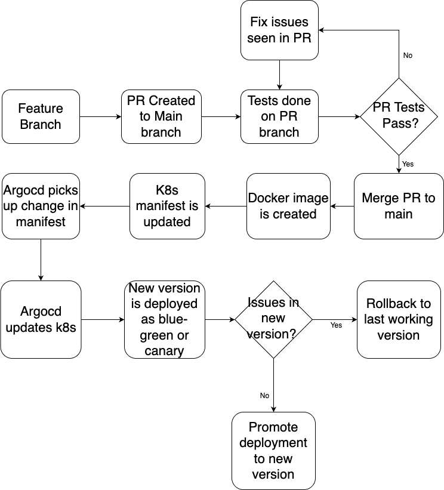
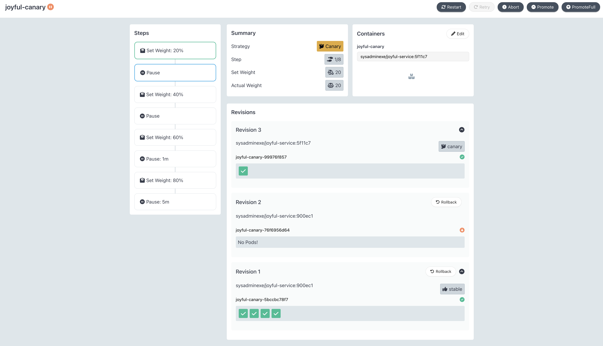

# Cloudnova Application Deployment via Argocd

## Argocd
This consists of Argocd configurations for the Cloudnova applications. Here we can find the following configurations:

- Argocd project for the cloudnova applications. This provides a logical grouping for the applications so that we can:
  - restrict what may be deployed (trusted Git source repositories)
  - restrict where apps may be deployed to (destination clusters and namespaces)
  - restrict what kinds of objects may or may not be deployed (e.g. RBAC, CRDs, DaemonSets, NetworkPolicy etc...)
  - defining project roles to provide application RBAC (bound to OIDC groups and/or JWT tokens)
- Appset for automatically creating argocd applications based on application directories 

## Applications
Argocd rollout is used to deploy the changes to Kubernetes clusters. The manifests can be found in the `apps` folder in `rollout.yaml`. 

2 applications - happy-service and joyful-service both have their source code in this repo in the `apps` directory. 

## Application deployment process
The approach is to Argocd rollouts where the main branch is the source of truth and as the start of deployment process. Changes made to the application is first tested in PRs before merged to the main branch where a docker image with commit sha as the tag is created and deployed into the environment. 




# Canary deployment - joyful-service
The deployment of this application is done using the canary method where the a new version is deployed along side the current version and the only a small percentage of the traffic is sent to the new version and gradually increase the traffic to the new version. If there any any issues with this new version, it is detected before the full rollout and a rollback is performed on argocd. 

```yaml
  strategy:
    canary:
      steps:
        - setWeight: 20
        - pause: {}
        - setWeight: 40
        - pause: {}
        - setWeight: 60
        - pause: {duration: 1m}
        - setWeight: 80
        - pause: {duration: 5m}
```




# Blue-Green deployment - happy-service
The deployment of this application is done via the blue-green method where there are 2 service endpoints available for this service - active for the blue and the preview for the green deployments. When a new version of the application is deployed, the new version runs along side the current version of the application. Traffic can be sent to the green deployment via the preview endpoint. Once the green deployment is tested for the new feature and all is good, green deployment can be promoted to the active and the previous deployment is phased out. If there are any issues seen in the green deployment, the application can be rolled back via argocd 

