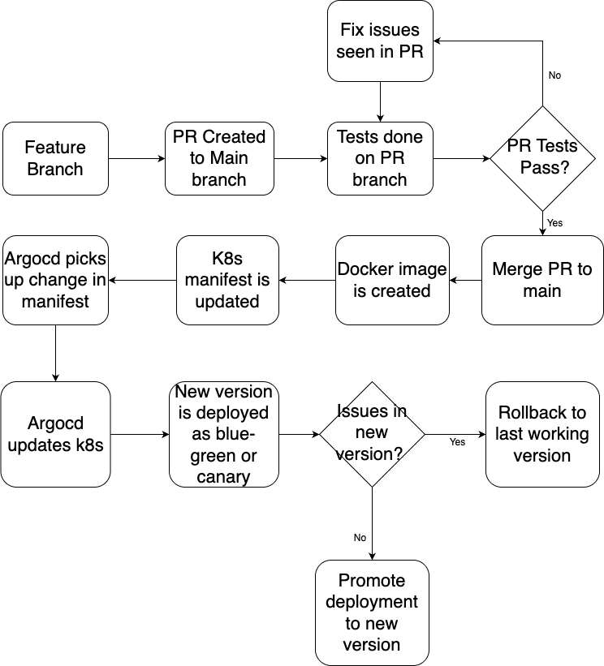

# Cloudnova Application Deployment via Argocd

## Argocd
This consists of Argocd configurations for the Cloudnova applications. Here we can find the following configurations:

- Argocd project for the cloudnova applications. This provides a logical grouping for the applications so that we can:
  - restrict what may be deployed (trusted Git source repositories)
  - restrict where apps may be deployed to (destination clusters and namespaces)
  - restrict what kinds of objects may or may not be deployed (e.g. RBAC, CRDs, DaemonSets, NetworkPolicy etc...)
  - defining project roles to provide application RBAC (bound to OIDC groups and/or JWT tokens)
- Appset for automatically creating argocd applications based on application directories 

## Applications
Argocd rollout is used to deploy the changes to Kubernetes clusters. The manifests can be found in the `apps` folder in `rollout.yaml`. 

2 applications - happy-service and joyful-service both have their source code in this repo in the `apps` directory. 

## Application deployment process
The approach is to use the main branch as the start of deployment process to production. Changes made to the application is first tested in PRs before merged to the main branch where a docker image with commit sha as the tag is created and deployed into the environment. 

