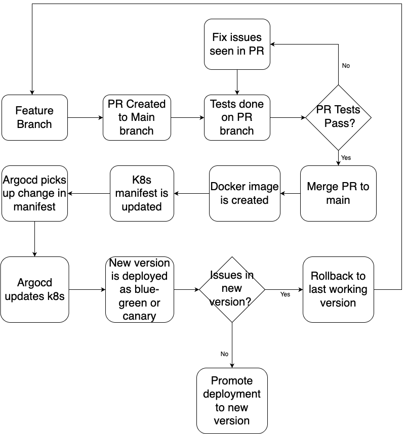
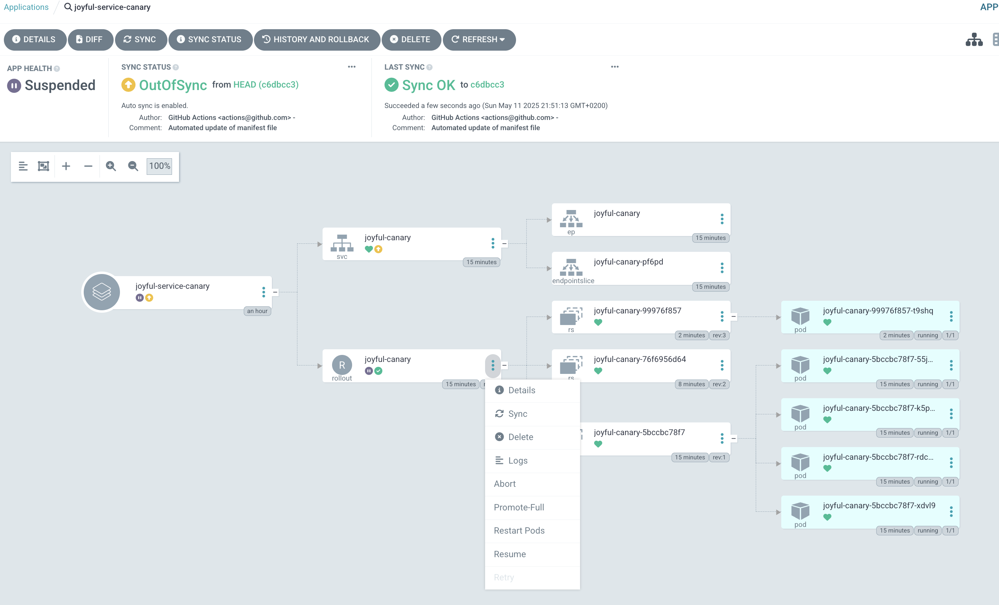
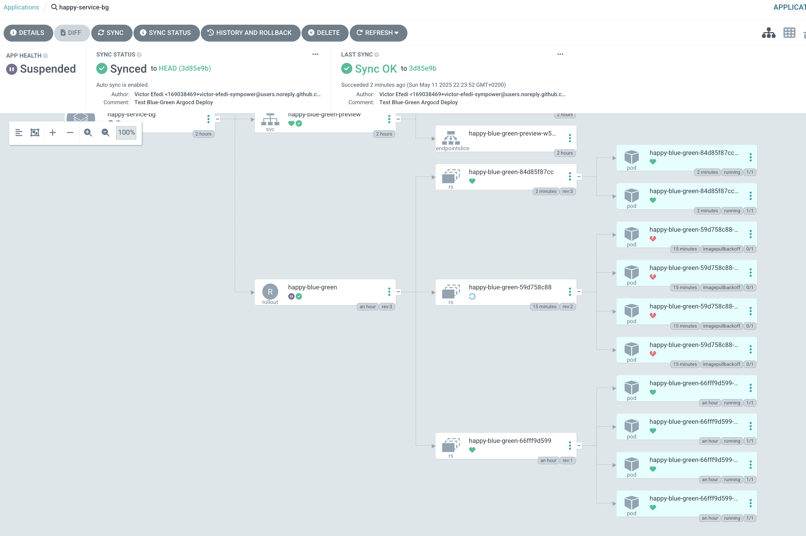
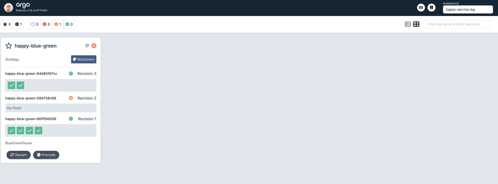

# Cloudnova Application Deployment via Argocd

## Argocd
This consists of Argocd configurations for the Cloudnova applications. Here we can find the following configurations:

- Argocd project for the cloudnova applications. This provides a logical grouping for the applications so that we can:
  - restrict what may be deployed (trusted Git source repositories)
  - restrict where apps may be deployed to (destination clusters and namespaces)
  - restrict what kinds of objects may or may not be deployed (e.g. RBAC, CRDs, DaemonSets, NetworkPolicy etc...)
  - defining project roles to provide application RBAC (bound to OIDC groups and/or JWT tokens)
- Appset for automatically creating argocd applications based on application directories 

## Applications
Argocd rollout is used to deploy the changes to Kubernetes clusters. The manifests can be found in the `apps` folder in `rollout.yaml`. 

2 applications - happy-service and joyful-service both have their source code in this repo in the `apps` directory. 

## Application deployment process
The approach is to Argocd rollouts where the main branch is the source of truth and as the start of deployment process. Changes made to the application is first tested in PRs before merged to the main branch where a docker image with commit sha as the tag is created and deployed into the environment. 

When a feature PR is created, the following processes take place:
- Tests is done on the branch to be sure that the change is not a breaking one. `.github/workflows/pr-test.yaml` checks for the PR for the changes in the app directory and runs a simple `go test` on the app directory
- When the PR checks passes, the PR can be merged to the main branch 
- The commit to the main branch triggers the `deploy-<service>.yaml` workflow which builds the image and tags it with the short sha and pushes to docker hub
- The workflow also updates the argocd rollout manifest which then causes argocd to sync the application and deploy the new version
- If there are no issues with the new version, it is promoted to the main active running version and the old version is phased out
- If there are issues with the new version, the application can be rolled back via argocd and the issue is fixed, tested and redeployed




# Canary deployment - joyful-service
The deployment of this application is done using the canary method where the a new version is deployed along side the current version and the only a small percentage of the traffic is sent to the new version and gradually increase the traffic to the new version. If there any any issues with this new version, it is detected before the full rollout and a rollback is performed on argocd. 

Canary config below states that on the first deployment of the new version, only 20% of the instances/replicas is for the new version. Any traffic sent there can be tested to be sure there are no issues. If after sometime, we see there are no issues reported, we promote the new version which moves 40% of the traffic to the new version while the former version is still running. After that is considered ok, we do one more promotion after which the remaining instances of the application is transitioned to the new version then the former version is phased out

```yaml
  strategy:
    canary:
      steps:
        - setWeight: 20
        - pause: {}
        - setWeight: 40
        - pause: {}
        - setWeight: 60
        - pause: {duration: 1m}
        - setWeight: 80
        - pause: {duration: 5m}
```




# Blue-Green deployment - happy-service
The deployment of this application is done via the blue-green method where there are 2 service endpoints available for this service - active for the blue and the preview for the green deployments. When a new version of the application is deployed, the new version runs along side the current version of the application. Traffic can be sent to the green deployment via the preview endpoint. Once the green deployment is tested for the new feature and all is good, green deployment can be promoted to the active and the previous deployment is phased out. If there are any issues seen in the green deployment, the application can be rolled back via argocd 


Blue-Green strategy config below sets the K8S services to be used for the blue and green pods. Auto promotion to the green service is disabled because you might want time to test to be sure that the new version works as expected. And the preview workloads is set to 2 replicas just to minimize resource consumption since it is a previvew version  

```yaml
  strategy:
    blueGreen:
      activeService: happy-blue-green-active
      previewService: happy-blue-green-preview
      autoPromotionEnabled: false
      previewReplicaCount: 2
      # abortScaleDownDelaySeconds: 10
      # scaleDownDelaySeconds: 60
      # autoPromotionSeconds: 20
```




